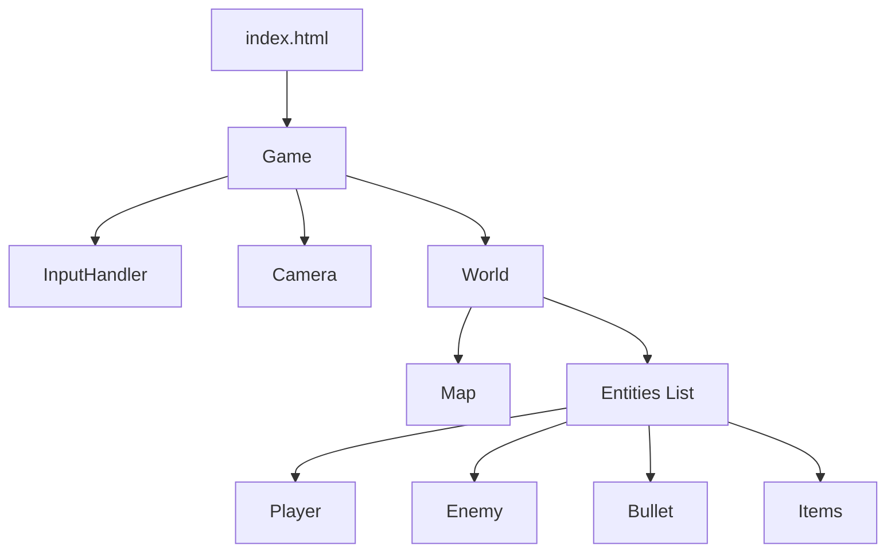
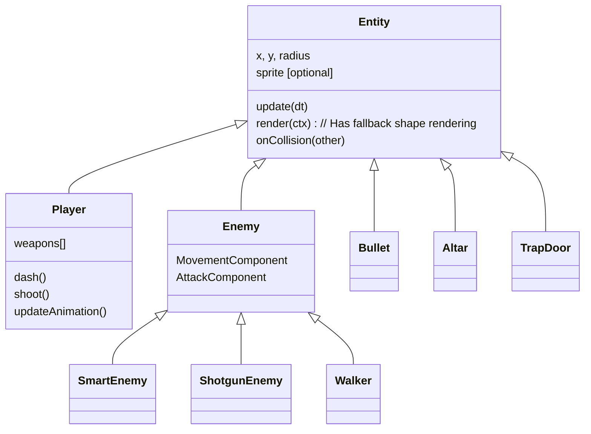

# JavaScript Shooter Game - Codebase Documentation

## 1. High-Level Architecture
The game follows a classic **Game Loop** architecture with a component-based entity system. It is built using vanilla ES6 JavaScript and the HTML5 Canvas API.

### Core Modules
*   **`Game.js`**: The entry point and state manager. It handles the `requestAnimationFrame` loop, timing (`dt`), inputs, and switching between game states (Menu, Play, GameOver).
*   **`World.js`**: The container for all game objects. It manages the `Map`, `Player`, `Entities` list, and global collision resolution.
*   **`Map.js`**: Responsible for procedural dungeon generation (Roguelike algorithm) and tile-based rendering.
*   **`Entity.js`**: The base class for all dynamic objects (Player, Enemies, Bullets, Items).
*   **`Config.js`**: Centralized configuration file for game balance, stats, and drop rates.
*   **`SaveManager.js`**: Utility for managing multi-slot save data and legacy migration.
*   **`UIManager.js`**: Manages all HUD elements, menus, and on-screen overlays.




---

## 2. Core Systems

### 2.1 The Game Loop (`Game.js`)
The `Game` class orchestrates the application lifecycle.
1.  **Input Handling**: Captures Keyboard and Mouse state via `Input.js`.
2.  **Update Loop**: Calculates `dt` (delta time) and calls `world.update(dt)`.
3.  **Render Loop**: Clears the canvas, applies Camera transform, calls `world.render(ctx)`, and draws UI overlay (Score, HP).

### 2.2 World Management (`World.js`)
The `World` acts as the "Scene".
*   **Initialization**: When `init()` is called, it:
    *   Tells `Map` to generate a new level.
    *   Spawns the `Player` at the start point.
    *   Spawns `TrapDoor` at the end point.
    *   Spawns `Altar` (on odd levels).
*   **Room Logic**: Tracks player room position. Spawns enemies when entering new rooms.
*   **Collision Pipeline**:
    *   **Broad Phase**: Iterates through entities.
    *   **Narrow Phase**: Calls `Entity.onCollision(other)` for specific interactions.
    *   **Wall Collision**: Checks `World.checkWallCollision(rect)` for physics resolution.

### 2.3 Map Generation (`Map.js`)
The map uses a **Room-and-Corridor** approach.
1.  **Grid**: A 2D array representing tiles (0=Floor, 1=Wall).
2.  **Room Placement**: Randomly places rectangles, checking for overlap.
3.  **Connections**: Connects each new room to the previous one with L-shaped corridors.
4.  **Rendering**: Uses a "2.5D" technique (Top Face + Front Face) and Culling for performance.

### 2.4 Z-Sorting & Rendering
To create a sense of depth, entities and map elements must be drawn in the correct order.
*   **Floor**: Drawn first (background).
*   **Entities**: Sorted by their vertical position (`sortY`).
    *   `Entity.sortY` defaults to `y`.
    *   **TrapDoor/Altar**: Forced to background layer to allow Player to walk "in front".
*   **Walls**: Drawn last (on top) to simulate occlusion.


### 2.5 Multi-Slot Save System (`SaveManager.js`)
The game supports multiple persistent runs using a structured save format.
*   **Storage**: Uses `localStorage` with JSON serialization.
*   **Slots**: Supports up to 3 slots (`roguelike_save_slot_1`, etc.).
*   **Metadata**: Stores high-level info (Level, Score, Date) in `roguelike_saves_metadata` for the selection screen.
*   **Migration**: Automatically converts legacy single-save data into Slot 1 (`checkLegacyMigration()`).
*   **Flow**:
    1.  Game Start → `UIManager.showSaveSelection()`
    2.  User Selects Slot → `Game.loadGame(slotId)`
    3.  `Game` loads data → Recreates `World` → Starts Loop.

### 2.6 User Interface System (`UIManager.js`)
The UI is decoupled from game logic, handling DOM overlays.
*   **States**:
    *   **HUD**: Hearts, Gold, Level, Score, Weapon Slots.
    *   **Menus**: Inventory (`I`), Stats (`P`), Skills (`O`).
    *   **Modal**: Save Selection, Exit Confirmation.
*   **Interactions**:
    *   **Exclusivity**: Opening one menu (e.g., Inventory) automatically closes others.
    *   **Pausing**: Menus trigger `Game.isPaused = true`.

---


## 3. Entity System
The game uses a mix of Inheritance (Entity API) and Composition (Enemy Behaviors).

### Class Hierarchy


### Component System (Enemies)
Enemies use components to define behavior:
*   **`MovementComponent`**: Handles navigation.
    *   `CHASE`: Direct vector movement.
    *   `SMART`: A* Pathfinding (Optimized) around obstacles.
*   **`AttackComponent`**: Handles combat.
    *   `PISTOL`, `RAPID`: Single targeted shots.
    *   `SHOTGUN`, `HEAVY`: Spread shots.
    *   `MELEE`: Body contact damage.

### Physics & Collision
*   **Movement**: Processed in `Entity.updatePhysics(dt)`.
*   **Wall Collision**: AABB logic against Map tiles.
*   **Entity Collision**: Decentralized. `World.js` detects overlap, then calls:
    *   `Bullet.onCollision(player)`
    *   `Player.onCollision(enemy)` (Dash logic)
    *   `Coin.onCollision(player)` (Pickup logic)

---

## 4. Game Features

### 4.1 Level Progression (Trap Door)
1.  **State**: Starts Closed.
2.  **Trigger**: Opens when Player enters the "Exit Room".
3.  **Transition**: Walking onto Open Door triggers `nextLevel()`.

### 4.2 Combat Mechanics
*   **Weapons**: Inventory system, diverse weaponry (Pistol, Shotgun, Heavy, Rifle).
*   **Skills (Abilities)**:
    *   **Ricochet**: Bullets bounce off walls ONCE.
    *   **Dash Shockwave**: AoE damage/knockback at end of dash.
    *   **Health Pack Carrier**: Passive ability to carry an extra health item.
*   **Stats (Upgrades)**:
    *   **Mobility**: Speed Boosts.
    *   **Health**: Max HP increases.
    *   **Attack**: Damage/Fire Rate (Planned).
*   **Visuals**: Particle systems for hits, dashes, and kills.


### 4.3 Player Animation (V2)
The `Player` entity uses an updated sprite sheet system:
*   **SpriteSheet**: `src/player_spritesheet_v2.png` (8 columns x 16 rows).
*   **State**: 
    *   `state`: 'idle' (Rows 0-7) or 'run' (Rows 8-15).
    *   `facing`: 0-7 (S, SE, E, NE, N, NW, W, SW) based on mouse angle.
*   **Rendering**: 
    *   Draws 96x96 frames (upscaled from 64x64) centered on the entity.
    *   Includes a debug hitbox (green circle) for collision verification.

### 4.4 Rendering Fallback
To prevent crashes and visual glitches, the base `Entity` class (and subclasses like `Player`, `Enemy`) now implements a **Sprite Fallback System**:
*   **Check**: Before drawing `this.sprite`, it verifies `this.sprite.complete`.
*   **Fallback**: If the sprite is missing or loading, it draws a generic geometric shape (Circle) using `this.radius` and `this.color`.
*   **Debug**: Ensures gameplay remains functional even with missing assets.

### 4.5 Pathfinding Optimization
The `SmartEnemy` uses A* Pathfinding (`Pathfinder.js`). Key optimizations prevent performance cliffs:
*   **Dynamic Obstacle Caching**: Before the main A* loop, the pathfinder iterates *once* over all entities to identify blocked tiles (Doors).
*   **Set Lookup**: Inside the neighbor search loop, it checks a `Set` of blocked coordinates instead of iterating the entire entity list again. This reduces complexity from O(Nodes * Entities) to O(Nodes + Entities).

---

## 5. Input & Data Flow
1.  **User Action**: Player moves Mouse.
2.  **Input.js**: Updates `mouse.x`, `mouse.y`.
3.  **Game Loop**: Calls `Player.update()`.
4.  **Player Logic**: Calculates angle to mouse, updates `facing` state.
5.  **Render**: `Player.render()` draws appropriate sprite frame.

---

## Directory Structure
```
src/
├── Game.js
├── World.js
├── Map.js
├── Config.js          # Game Constants
├── components/        # Behavior Components
│   ├── MovementComponent.js
│   └── AttackComponent.js
├── entities/
│   ├── Entity.js
│   ├── Player.js
│   ├── Enemy.js
│   └── ...
├── ui/
│   └── UIManager.js   # UI Logic
└── utils/
    ├── PathFinder.js  # A* Utility
    └── SaveManager.js # Persistence

```
