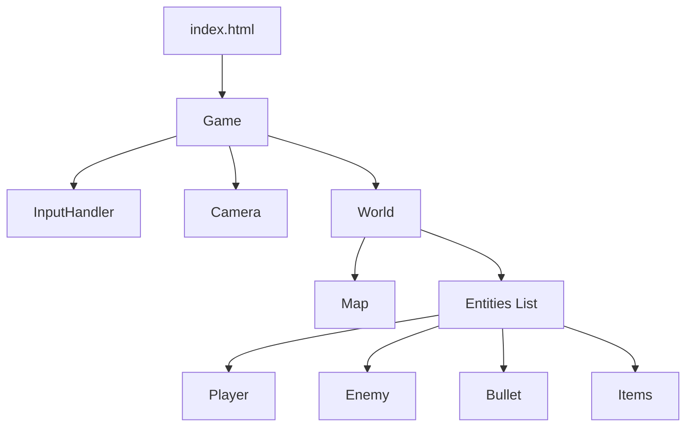
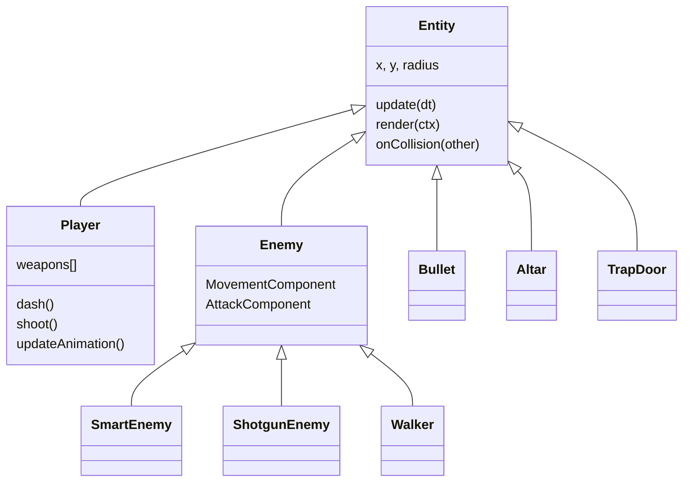

# JavaScript Shooter Game - Codebase Documentation

## 1. High-Level Architecture
The game follows a classic **Game Loop** architecture with a component-based entity system. It is built using vanilla ES6 JavaScript and the HTML5 Canvas API.

### Core Modules
*   **`Game.js`**: The entry point and state manager. It handles the `requestAnimationFrame` loop, timing (`dt`), inputs, and switching between game states (Menu, Play, GameOver).
*   **`World.js`**: The container for all game objects. It manages the `Map`, `Player`, `Entities` list, and global collision resolution.
*   **`Map.js`**: Responsible for procedural dungeon generation (Roguelike algorithm) and tile-based rendering.
*   **`Entity.js`**: The base class for all dynamic objects (Player, Enemies, Bullets, Items).
*   **`Config.js`**: Centralized configuration file for game balance, stats, and drop rates.



---

## 2. Core Systems

### 2.1 The Game Loop (`Game.js`)
The `Game` class orchestrates the application lifecycle.
1.  **Input Handling**: Captures Keyboard and Mouse state via `Input.js`.
2.  **Update Loop**: Calculates `dt` (delta time) and calls `world.update(dt)`.
3.  **Render Loop**: Clears the canvas, applies Camera transform, calls `world.render(ctx)`, and draws UI overlay (Score, HP).

### 2.2 World Management (`World.js`)
The `World` acts as the "Scene".
*   **Initialization**: When `init()` is called, it:
    *   Tells `Map` to generate a new level.
    *   Spawns the `Player` at the start point.
    *   Spawns `TrapDoor` at the end point.
    *   Spawns `Altar` (on odd levels).
*   **Room Logic**: Tracks player room position. Spawns enemies when entering new rooms.
*   **Collision Pipeline**:
    *   **Broad Phase**: Iterates through entities.
    *   **Narrow Phase**: Calls `Entity.onCollision(other)` for specific interactions.
    *   **Wall Collision**: Checks `World.checkWallCollision(rect)` for physics resolution.

### 2.3 Map Generation (`Map.js`)
The map uses a **Room-and-Corridor** approach.
1.  **Grid**: A 2D array representing tiles (0=Floor, 1=Wall).
2.  **Room Placement**: Randomly places rectangles, checking for overlap.
3.  **Connections**: Connects each new room to the previous one with L-shaped corridors.
4.  **Rendering**: Uses a "2.5D" technique (Top Face + Front Face) and Culling for performance.

### 2.4 Z-Sorting & Rendering
To create a sense of depth, entities and map elements must be drawn in the correct order.
*   **Floor**: Drawn first (background).
*   **Entities**: Sorted by their vertical position (`sortY`).
    *   `Entity.sortY` defaults to `y`.
    *   **TrapDoor/Altar**: Forced to background layer to allow Player to walk "in front".
*   **Walls**: Drawn last (on top) to simulate occlusion.

---

## 3. Entity System
The game uses a mix of Inheritance (Entity API) and Composition (Enemy Behaviors).

### Class Hierarchy


### Component System (Enemies)
Enemies use components to define behavior:
*   **`MovementComponent`**: Handles navigation.
    *   `CHASE`: Direct vector movement.
    *   `SMART`: A* Pathfinding around obstacles.
*   **`AttackComponent`**: Handles combat.
    *   `PISTOL`, `RAPID`: Single targeted shots.
    *   `SHOTGUN`, `HEAVY`: Spread shots.
    *   `MELEE`: Body contact damage.

### Physics & Collision
*   **Movement**: Processed in `Entity.updatePhysics(dt)`.
*   **Wall Collision**: AABB logic against Map tiles.
*   **Entity Collision**: Decentralized. `World.js` detects overlap, then calls:
    *   `Bullet.onCollision(player)`
    *   `Player.onCollision(enemy)` (Dash logic)
    *   `Coin.onCollision(player)` (Pickup logic)

---

## 4. Game Features

### 4.1 Level Progression (Trap Door)
1.  **State**: Starts Closed.
2.  **Trigger**: Opens when Player enters the "Exit Room".
3.  **Transition**: Walking onto Open Door triggers `nextLevel()`.

### 4.2 Combat Mechanics
*   **Weapons**: Inventory system, diverse weaponry (Pistol, Shotgun, Heavy, Rifle).
*   **Skills**:
    *   **Ricochet**: Bullets bounce off walls ONCE.
    *   **Dash Knockback**: AoE knockback effect at end of dash.
*   **Visuals**: Particle systems for hits, dashes, and kills.

### 4.3 Player Animation
The `Player` entity uses a sprite sheet-based animation system:
*   **SpriteSheet**: `src/player_spritesheet.png` (4 columns x 3 rows).
*   **State**: Tracks `facing` (Up, Down, Left, Right). Left is a flipped render of Right.
*   **Rendering**: Draws 64x64 frames centered on the entity.

---

## 5. Input & Data Flow
1.  **User Action**: Player moves Mouse.
2.  **Input.js**: Updates `mouse.x`, `mouse.y`.
3.  **Game Loop**: Calls `Player.update()`.
4.  **Player Logic**: Calculates angle to mouse, updates `facing` state.
5.  **Render**: `Player.render()` draws appropriate sprite frame.

---

## Directory Structure
```
src/
├── Game.js
├── World.js
├── Map.js
├── Config.js          # Game Constants
├── components/        # Behavior Components
│   ├── MovementComponent.js
│   └── AttackComponent.js
├── entities/
│   ├── Entity.js
│   ├── Player.js
│   ├── Enemy.js
│   └── ...
└── ...
```
