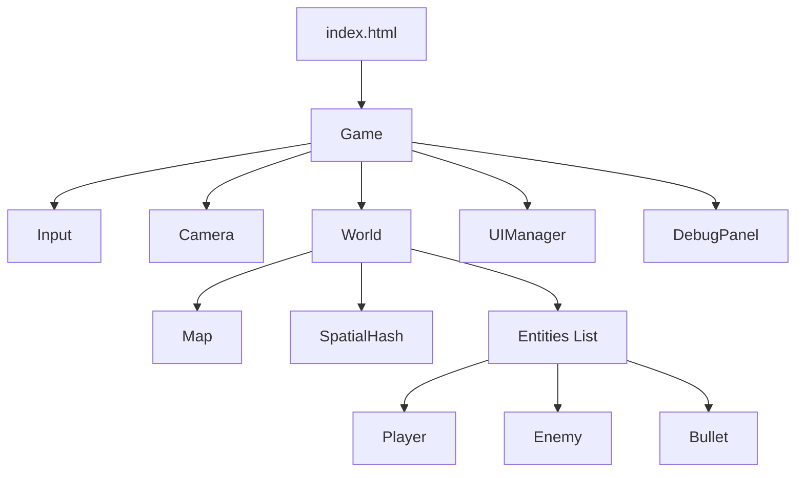
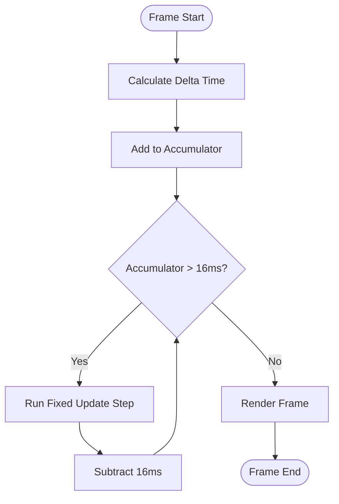
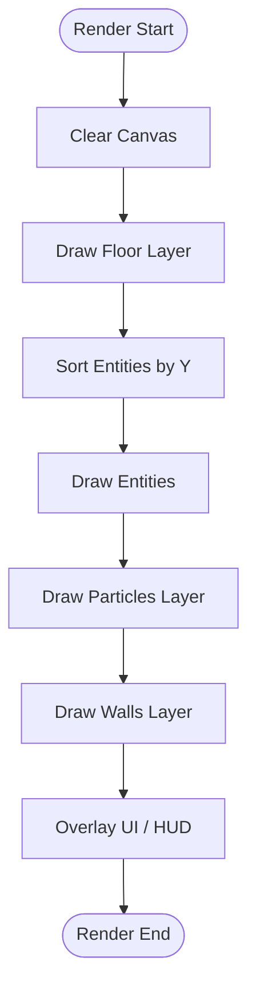

# JavaScript Shooter Game - Codebase Documentation

## 1. Directory Structure

```breadcrumbs
src/
├── Game.js                # Entry point, Game Loop, State Management
├── World.js               # Game Scene, Entity Manager, Collision Dispatcher
├── Map.js                 # Level Generation (Roguelike), Tile Rendering
├── Config.js              # Global constants, balance settings, assets
├── Camera.js              # Viewport scrolling and following logic
├── Input.js               # Keyboard/Mouse event listeners
├── main.js                # Bootstrapper
├── components/            # Composition Logic (ECS-lite)
│   ├── MovementComponent.js  # AI Pathfinding & Movement types
│   └── AttackComponent.js    # AI Combat logic (Shoot, Melee)
├── entities/              # Game Objects
│   ├── Entity.js          # Base class (Physics, Render, Lifecycle)
│   ├── Player.js          # Player logic (Input, Stats, Inventory)
│   ├── Enemy.js           # Base Enemy class
│   ├── Bullet.js          # Projectile logic
│   ├── Coin.js            # Collectible Currency
│   ├── HealthPack.js      # Collectible Health
│   ├── WeaponItem.js      # Collectible Weapons
│   ├── Door.js            # Room connections
│   ├── TrapDoor.js        # Level Exit logic
│   ├── Altar.js           # Interactable Stat Upgrades
│   ├── Particle.js        # Visual effects
│   ├── Spawner.js         # Dynamic enemy spawning
│   ├── Walker.js          # specific enemy variant
│   ├── SmartEnemy.js      # specific enemy variant
│   ├── StealthEnemy.js    # specific enemy variant
│   ├── ShotgunEnemy.js    # specific enemy variant
│   ├── HeavyShotgunEnemy.js # specific enemy variant
│   └── RapidFireEnemy.js  # specific enemy variant
├── ui/                    # User Interface
│   ├── UIManager.js       # HUD, Menus, Modals
│   └── DebugPanel.js      # Performance Monitor (F3)
└── utils/                 # Utilities
    ├── Pathfinder.js      # A* Algorithm
    ├── SaveManager.js     # Persistence & Migration
    └── SpatialHash.js     # Spatial Partitioning (Collision Optimization)
```

---

## 2. High-Level Architecture
The game follows a classic **Game Loop** architecture with a component-based entity system. It is built using vanilla ES6 JavaScript and the HTML5 Canvas API.

### Core Modules
*   **`Game.js`**: The orchestrator. manages the `requestAnimationFrame` loop, timing (`dt`), inputs, and high-level states (Menu, Play, GameOver).
*   **`World.js`**: The "Scene". It manages all game objects, the map, and runs the collision pipeline.
*   **`SpatialHash.js`**: **(New)** A spatial partitioning system that creates a grid of "buckets" to optimize collision detection from $O(N^2)$ to near $O(N)$.
*   **`DebugPanel.js`**: **(New)** A real-time performance monitor accessible via **F3**, displaying FPS, Update/Render times, and Entity counts.



---

## 3. Core Systems

### 3.1 The Game Loop (`Game.js`)
The game loop uses a **Fixed Time Step** architecture. This ensures physics and logic (movement, collision) always run at a consistent 60 FPS (16.6ms per step), regardless of the actual frame rate (e.g., 144Hz monitors or slow laptops).

#### **3.1.1 Main Loop Flow**
1.  **Input**: Capture user actions.
2.  **Accumulator**: Add elapsed time (`dt`) to a "time bank".
3.  **Update**: Consume time from the bank in fixed 16ms chunks.
4.  **Render**: Draw the state as it is *after* the updates.



#### **3.1.2 Render Loop Breakdown**
The `World.render()` method layers visuals to create depth.



### 3.2 Spatial Partitioning (`SpatialHash.js` & `World.js`)
To handle high entity counts without lag:
1.  **Bucketing**: Every frame, `SpatialHash.clear()` is called. Active entities are re-inserted into grid cells based on their position and radius.
2.  **Querying**: During collision checks, entities only check against neighbors in the same bucket(s).
3.  **Optimization**: Static objects (like Items) are also hashed to ensure quick pickup detection.

### 3.3 Map Generation (`Map.js`)
The map uses a **Room-and-Corridor** algorithm:
1.  **Grid**: 2D array (0=Floor, 1=Wall).
2.  **Rooms**: Randomly places non-overlapping rectangles.
3.  **Connections**: L-shaped corridors connect each new room to the previous one.
4.  **Rendering**: Uses a "2.5D" style (Top Face + Front Face) with extensive caching logic to prevent redundant draw calls.

### 3.4 Multi-Slot Save System (`SaveManager.js`)
*   **Storage**: `localStorage` with JSON.
*   **Slots**: Supports multiple slots (`roguelike_save_slot_N`).
*   **Migration**: `checkLegacyMigration()` converts old save formats to the new slot-based schema automatically to preserve user progress.

---

## 4. Entity System
The game uses a mix of Inheritance (Entity API) and Composition (Enemy Behaviors).

### Class Hierarchy
*   **`Entity`**: Base class. Handles position `x,y`, `radius`, `physics` (friction/velocity), and `render` (sprite or fallback shape).
*   **`Player`**: Handles weapons, shooting, dashing, and inputs.
*   **`Enemy`**: Delegates logic to Components.
    *   **`MovementComponent`**: Handles `CHASE` (direct) or `SMART` (A*) movement.
    *   **`AttackComponent`**: Handles `PISTOL`, `SHOTGUN`, etc. firing patterns.

---

## 5. Game Features

### 5.1 Progression
*   **Trap Door**: Opens when the player enters the final room. Leads to `nextLevel()`.
*   **Altar**: Spawns in random rooms on odd levels, offering stat upgrades (Speed, Max HP).
*   **Loot**: Enemies drop Coins and Health Packs. Chests (planned) or high-tier enemies drop Weapons.

### 5.2 Combat
*   **Weapons**: Varied arsenal (Pistol, Shotgun, Heavy Shotgun).
*   **Abilities**: Unlockable skills like "Ricochet" and "Dash Shockwave".
*   **Particles**: `Particle.js` provides visual feedback for hits, dashes, and object destruction.

### 5.3 Performance Monitoring
*   **Toggle**: Press **F3**.
*   **Metrics**:
    *   **FPS**: Frame integrity.
    *   **Update**: Logic processing time.
    *   **Render**: Drawing time (broken down by Floor/Entities/Walls).
    *   **Collisions**: Active collision pairs checked per frame.

---

## 6. Input Controls
*   **WASD / Arrows**: Move
*   **Mouse**: Aim
*   **Left Click**: Shoot
*   **Space**: Dash
*   **I**: Inventory
*   **P**: Stats
*   **O**: Skills
*   **Esc**: Pause / Menu
*   **F3**: Debug Panel
