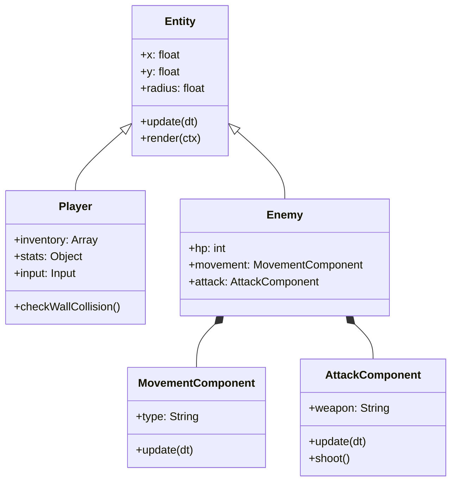
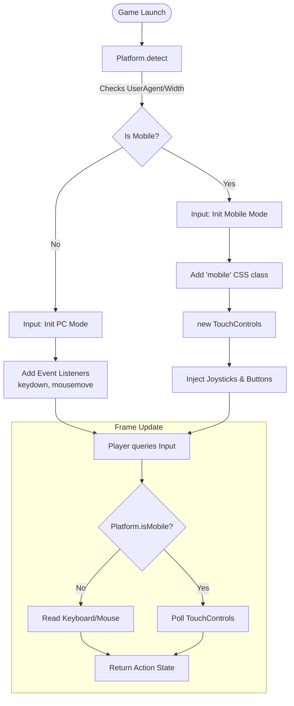

# JavaScript Shooter Game - Codebase Documentation

## 1. Directory Structure

```breadcrumbs
src/
├── main.js                # Bootstrapper
├── Platform.js            # Device Detection
├── Config.js              # Global constants, balance settings, assets
├── core/                  # Core Engine
│   ├── Game.js            # Entry point, Game Loop, State Management
│   ├── World.js           # Game Scene, Entity Manager, Collision Dispatcher
│   ├── Map.js             # Level Generation (Roguelike), Tile Rendering
│   ├── Camera.js          # Viewport scrolling and following logic
│   └── Input.js           # Input Manager (PC/Mobile abstraction)
├── components/            # Composition Logic (ECS-lite)
│   ├── MovementComponent.js  # AI Pathfinding & Movement types
│   └── AttackComponent.js    # AI Combat logic (Shoot, Melee)
├── entities/              # Game Objects
│   ├── Entity.js          # Base class
│   ├── Player.js          # Player logic
│   └── ... (Enemies, Items, Projectiles)
├── ui/                    # User Interface
│   ├── UIManager.js       # HUD, Menus, Modals
│   ├── TouchControls.js   # Mobile Virtual Joysticks & Buttons
│   └── DebugPanel.js      # Performance Monitor (F3)
└── utils/                 # Utilities
    ├── Pathfinder.js      # A* Algorithm
    ├── SaveManager.js     # Persistence & Migration
    └── SpatialHash.js     # Spatial Partitioning
```

---

## 2. High-Level Architecture
The game follows a classic **Game Loop** architecture with a component-based entity system. It is built using vanilla ES6 JavaScript and the HTML5 Canvas API.

### Core Modules
*   **`Game.js`**: The orchestrator. manages the `requestAnimationFrame` loop, timing (`dt`), inputs, and high-level states (Menu, Play, GameOver).
*   **`World.js`**: The "Scene". It manages all game objects, the map, and runs the collision pipeline.
*   **`SpatialHash.js`**: **(New)** A spatial partitioning system that creates a grid of "buckets" to optimize collision detection from $O(N^2)$ to near $O(N)$.
*   **`DebugPanel.js`**: **(New)** A real-time performance monitor accessible via **F3**, displaying FPS, Update/Render times, and Entity counts.


---

## 3. Core Systems

### 3.1 The Game Loop (`Game.js`)
The game loop uses a **Fixed Time Step** architecture. This ensures physics and logic (movement, collision) always run at a consistent 60 FPS (16.6ms per step), regardless of the actual frame rate (e.g., 144Hz monitors or slow laptops).

#### **3.1.1 Main Loop Flow**
1.  **Input**: Capture user actions.
2.  **Accumulator**: Add elapsed time (`dt`) to a "time bank".
3.  **Update**: Consume time from the bank in fixed 16ms chunks.
4.  **Render**: Draw the state as it is *after* the updates.


#### **3.1.2 Render Loop Breakdown**
The `World.render()` method layers visuals to create depth.


### 3.2 Spatial Hashing (Collision Optimization)
The game uses a **Grid-based Spatial Hash** (`SpatialHash.js`) to optimize the collision detection phase.

1.  **Bucketing**: The world is divided into large grid cells ($2 \times$ Tile Size).
2.  **Insertion**: Every frame, *active* entities are mapped to the cells they overlap.
3.  **Querying**: Collision checks are restricted to entities within the same or adjacent cells, reducing complexity from $O(N^2)$ to $O(N)$.

### 3.3 Room-Based Logic Culling (Update Optimization)
To maintain performance with thousands of entities, the game uses a **Room-based Culling** system in `World.js`.

*   **Room ID**: Every entity is assigned a `roomID` upon spawning (corresponding to the `Map.rooms` index).
*   **Asleep/Awake States**:
    *   **Awake (`isActive = true`)**: Entities in the player's current room (or global entities like bullets) update normally.
    *   **Asleep (`isActive = false`)**: Entities in other rooms pause their logic (movement, pathfinding) to save CPU cycles.
*   **Hybrid Benefit**: This separates the concern of "physics presence" (always needed for static collision) from "AI logic" (only needed when near).

### 3.4 Map Generation (`Map.js`)
The map uses a **Room-and-Corridor** algorithm:
1.  **Grid**: 2D array (0=Floor, 1=Wall).
2.  **Rooms**: Randomly places non-overlapping rectangles.
3.  **Connections**: L-shaped corridors connect each new room to the previous one.
4.  **Rendering**: Uses a "2.5D" style (Top Face + Front Face) with extensive caching logic to prevent redundant draw calls.

### 3.5 Multi-Slot Save System (`SaveManager.js`)

#### **3.5.1 Storage Architecture**
*   **Storage Medium**: Browser `localStorage`.
*   **Key Format**: `roguelike_save_slot_{N}` (e.g., `roguelike_save_slot_1`).
*   **Metadata**: A separate key `roguelike_saves_metadata` stores a summary of all slots for the menu UI.

#### **3.5.2 Save Data Structure (JSON)**
The game saves a complete snapshot of the player's progression and run state.

```json
{
  "metadata": {
    "name": "Run #1",          // Display name
    "lastSaved": 171542389123 // Timestamp (ms)
  },
  "gameplay": {
    "bank": 1500,             // Persistent Gold
    "highScore": 5420,        // Best Score (Per Slot)
    "level": 4,               // Current Floor
    "score": 1250,            // Current Run Score
    "unlockedStats": [        // Permanent Upgrades
      "speed_boost_1", 
      "health_boost_1"
    ],
    "unlockedSkills": [       // Acquired Abilities
      "ricochet_bullets",
      "dash_shockwave"
    ],
    "inventory": {            // (Planned)
      "backpack": [],
      "equipped": {}
    }
  }
}
```

#### **3.5.3 Migration Strategy**
The `checkLegacyMigration()` method runs at startup. If it detects old flat keys (e.g., `roguelike_bank`), it automatically bundles them into `Slot 1` and cleans up the legacy keys, ensuring no data loss for returning players.

---

## 4. Entity System
The game uses a mix of Inheritance (Entity API) and Composition (Enemy Behaviors).

### Class Hierarchy
*   **`Entity`**: Base class. Handles position `x,y`, `radius`, `physics` (friction/velocity), and `render` (sprite or fallback shape).
*   **`Player`**: Handles weapons, shooting, dashing, and inputs.
*   **`Enemy`**: Delegates logic to Components.
    *   **`MovementComponent`**: Handles `CHASE` (direct) or `SMART` (A*) movement.
    *   **`AttackComponent`**: Handles `PISTOL`, `SHOTGUN`, etc. firing patterns.



---

## 5. Game Features

### 5.1 Progression
*   **Trap Door**: Opens when the player enters the final room. Leads to `nextLevel()`.
*   **Altar**: Spawns in random rooms on odd levels, offering stat upgrades (Speed, Max HP).
*   **Loot**: Enemies drop Coins and Health Packs. Chests (planned) or high-tier enemies drop Weapons.

### 5.2 Combat
*   **Weapons**: Varied arsenal (Pistol, Shotgun, Heavy Shotgun).
*   **Abilities**: Unlockable skills like "Ricochet" and "Dash Shockwave".
*   **Particles**: `Particle.js` provides visual feedback for hits, dashes, and object destruction.

### 5.3 Performance Monitoring
*   **Toggle**: Press **F3**.
*   **Metrics**:
    *   **FPS**: Frame integrity.
    *   **Update**: Logic processing time.
    *   **Render**: Drawing time (broken down by Floor/Entities/Walls).
    *   **Collisions**: Active collision pairs checked per frame.

---

## 6. Input Controls

The game automatically detects the device type at startup (`Platform.js`) and adapts controls accordingly.

### 6.1 Input Architecture
The input system abstracts the hardware layer, allowing the rest of the game logic (`Player.js`) to query actions (e.g., `isShooting()`) without knowing the source device.

**Initialization Flow:**
1.  **Startup (`main.js`)**: Calls `Platform.detect()` to determine if the device is Mobile or PC.
2.  **Setup (`Input.js`)**:
    *   **Mobile**: Instantiates `TouchControls.js` which injects DOM overlays (joysticks/buttons).
    *   **PC**: Attaches standard `keydown`/`mousemove` event listeners to the window.
3.  **Game Loop**: The `Input` class checks the active mode to return normalized vectors and booleans.



### 6.2 PC (Keyboard & Mouse)
*   **WASD**: Move
*   **Mouse**: Aim
*   **Left Click**: Shoot
*   **Space / Shift**: Dash
*   **Q / Arrows**: Switch Weapon
*   **E**: Interact
*   **I**: Inventory
*   **P**: Stats
*   **O**: Skills
*   **Esc**: Pause
*   **F3**: Debug Panel

### 6.2 Mobile (Touch Controls)
*   **Left Joystick**: Move
*   **Right Joystick**: Aim & Shoot (Drag to aim, hold away from center to shoot)
*   **Dash Button**: Dash
*   **Swap Button (⟳)**: Switch Weapon
*   **Hand Button**: Interact
*   **HUD Buttons**:
    *   **INV**: Inventory
    *   **STATS**: Player Stats
    *   **SKILLS**: Skill Tree
