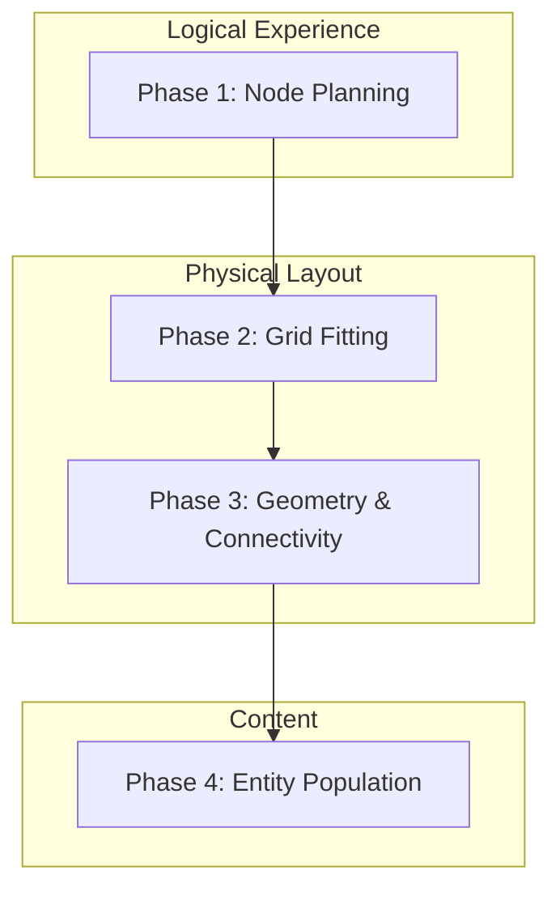
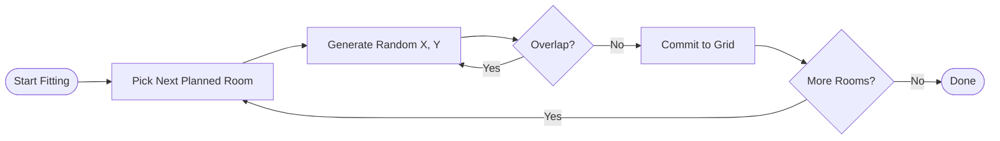
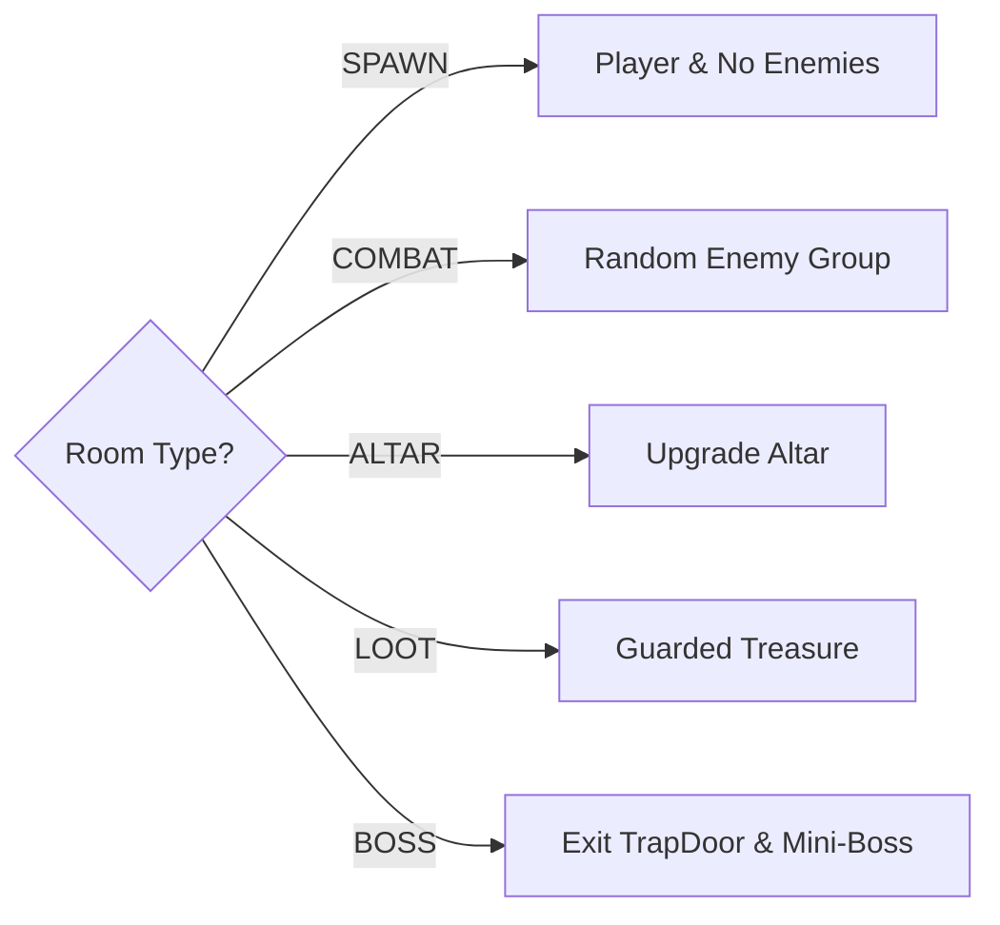

# Procedural Level Generation Procedure

This document outlines the step-by-step logic used to create structured, procedural levels in the game. The system follows a **Node-First** approach, planning the experience before placing a single tile.

## Overview of the 4-Phase Flow

---

## Phase 1: Node Planning
Before physical space is allocated, the game generates a "Mission Graph." This ensures every level has a balanced progression based on `CONFIG.LEVEL.ROOM_COUNT` (default: 10).

**The Sequence:**
1.  **SPAWN**: Always the first room (index 0). No enemies.
2.  **ALTAR**: Guaranteed halfway point for upgrades (index self.roomCount/2).
3.  **LOOT**: Interspersed treasure rooms (every 4 rooms).
4.  **COMBAT**: Randomized challenge rooms for all other slots.
5.  **BOSS**: Always the final room leading to the exit `TrapDoor`.

---

## Phase 2: Grid Fitting
The generator attempts to "fit" these planned nodes into the 2D tile grid.

- **Room Sizes**: Random range between 8x8 and 13x13 tiles.
- **Collision Padding**: Rooms are placed with a 2-tile buffer (including corridors) to ensure the dungeon doesn't become a single condensed block.
- **Retry Logic**: If a critical room (Spawn/Boss) can't be placed, the generator retries up to 200 times. Non-critical rooms retry 50 times before being skipped.

---

## Phase 3: Geometry & Templates
Each room type can be assigned a **Geometric Template** to break the monotony of rectangular dungeons.

| Shape | Logic | Best Use Case |
| :--- | :--- | :--- |
| **RECT** | Standard floor fill. | Spawn, corridors. |
| **CIRCLE** | Distance-based fill from center: `(dx^2 + dy^2) <= 1`. | Boss arenas. |
| **CROSS** | Only horizontal and vertical strips (20% width/height). | High-tension combat. |
| **VOID_CENTER** | Border floor with a pillar in the middle. | Loot rooms, Altars. |

---

## Phase 4: Connectivity & Doors
Once rooms are placed, they are linked via **Wide Corridors** (2 tiles wide).

1.  **Center-to-Center**: A path is drawn from Room A's center to Room B's center.
2.  **L-Shaped Corridors**: Path flips between horizontal then vertical (or vice-versa) based on a 50/50 chance.
3.  **Door Discovery**: The system scans the perimeter of every room. If a room floor tile touches a corridor floor tile, a `DoorSpot` is marked. A `Door` entity is then spawned to regulate room state (locking/unlocking).

---

## Phase 5: Entity Population
Finally, the `World` class reads the `type` of each placed room to decide what to spawn.

### Key Rules:
- **Safety Zones**: Enemies are never spawned within **120 pixels** of any room door to prevent immediate damage upon entry.
- **Difficulty Scaling**: The system uses a weighted picker (`pickEnemyType`) that introduces harder tiers as `game.level` increases:
    - **Lvl 2+**: `SmartEnemy`, `Spawner`.
    - **Lvl 3+**: `RapidFireEnemy`.
    - **Lvl 4+**: `ShotgunEnemy`, `StealthEnemy`.
    - **Lvl 6+**: `HeavyShotgunEnemy`.
- **Room Lock Logic**: When a player enters a room (via `triggered`), all doors lock until all enemies belonging to that room (`roomID`) are defeated.
