# Game Lifecycle Documentation

This document illustrates the complete temporal flow of the game from initial page load to the Game Over state, with emphasis on **when and how levels are created**.

---

## Overview: The Three Worlds

The game creates **three separate World instances** during a typical session:

1. **Constructor World** (Line 35 in `Game.js`) - Created immediately, **never used for gameplay**
2. **LoadGame World** (Line 64 in `Game.js`) - Created when user selects a save slot, **this is the actual playable world**
3. **Restart World** (Line 138 in `Game.js`) - Created after Game Over when player clicks Restart

---

## Phase 1: Site Launch → Save Selection

```mermaid
sequenceDiagram
    participant Browser
    participant main.js
    participant Platform
    participant Game
    participant World1 as World (Constructor)
    participant UIManager
    participant Input
    
    Browser->>main.js: DOMContentLoaded
    main.js->>Platform: detect()
    Note over Platform: Sets Platform.isMobile<br/>Adds 'mobile' class to body
    
    main.js->>Game: new Game(canvas)
    activate Game
    
    Game->>Input: new Input(this)
    Note over Input: Creates TouchControls<br/>if Platform.isMobile
    
    Game->>World1: new World(this)
    activate World1
    Note over World1: ⚠️ This World is NEVER used!<br/>It's immediately orphaned.
    World1->>World1: Map.generate()
    World1->>World1: Spawn Player at startPoint
    World1->>World1: Spawn Doors, TrapDoor
    deactivate World1
    
    Game->>UIManager: new UIManager(this)
    UIManager->>UIManager: showSaveSelection()
    Note over UIManager: Displays 3 save slots<br/>Game is PAUSED
    
    deactivate Game
    
    Note over Browser,UIManager: ⏸️ Game loop NOT started yet<br/>User sees Save Selection screen
```

**Key Insight:** The first `World` created in the constructor is **wasted**. It generates a full level that is never rendered or played. This happens because `Game.js` line 44 immediately shows the save selection screen, pausing the game before `start()` is called.

---

## Phase 2: Save Selection → Level Generation

```mermaid
sequenceDiagram
    participant User
    participant UIManager
    participant Game
    participant SaveManager
    participant World2 as World (LoadGame)
    participant Map
    participant Player
    
    User->>UIManager: Click Save Slot
    UIManager->>Game: loadGame(slotId)
    activate Game
    
    Game->>SaveManager: loadSlot(slotId)
    SaveManager-->>Game: { bank, unlockedStats, level, ... }
    
    Note over Game: Restore progression data<br/>(bank, skills, level, score)
    
    Game->>World2: new World(this)
    activate World2
    Note over World2: 🎮 THIS is the playable World!
    
    World2->>Map: new Map(game)
    activate Map
    Map->>Map: generate()
    Note over Map: 1. Create rooms (BSP)<br/>2. Connect with corridors<br/>3. Place doors<br/>4. Set start/end points
    deactivate Map
    
    World2->>Player: new Player(game, spawnX, spawnY)
    Note over Player: Apply unlocked stats<br/>from game.unlockedStats
    
    World2->>World2: Spawn Doors (from map.doorSpots)
    World2->>World2: Spawn TrapDoor (at map.endPoint)
    World2->>World2: Link doors to rooms
    
    deactivate World2
    
    Game->>Game: start()
    Note over Game: Begins requestAnimationFrame loop
    
    deactivate Game
    
    Note over User,Game: ▶️ Game loop ACTIVE<br/>Level is fully generated and playable
```

**Answer to "When is the level created?"**

The **playable level** is created in `World.js` constructor (line 26-35), which is called from `Game.loadGame()` (line 64). This happens **immediately after** the user selects a save slot.

The level generation sequence:
1. `Map.generate()` creates the dungeon layout (BSP rooms + corridors)
2. Player spawns at `map.startPoint`
3. Doors spawn at `map.doorSpots`
4. TrapDoor (exit) spawns at `map.endPoint`
5. Enemies spawn when player enters rooms (lazy spawning in `World.update()`)

---

## Phase 3: Gameplay Loop

**Key Points:**
- Enemies are **not** spawned during level generation
- They spawn **lazily** when the player enters a room for the first time
- Each room tracks `room.spawned` to prevent re-spawning
- Difficulty scales with `game.level` (more enemies, tougher types)

---

## Phase 4: Level Progression (TrapDoor)

**Important:** `nextLevel()` does **not** create a new `World` instance. It:
1. Clears entities (except Player)
2. Generates a new `Map`
3. Re-spawns doors and exit
4. Resets room states

This is more efficient than recreating the entire World.

---

## Phase 5: Game Over → Restart

**Restart Behavior:**
- Creates a **new World** (third instance)
- Resets `level` and `score`
- **Preserves** `bank` and unlocked skills (meta-progression)
- **Preserves** player's backpack inventory
- Generates a fresh Level 1

---

## Summary: World Creation Timeline

| Event | World Instance | Purpose | Playable? |
|:------|:--------------|:--------|:----------|
| `new Game()` | World #1 | Constructor artifact | ❌ No (orphaned) |
| `loadGame(slotId)` | World #2 | Actual gameplay | ✅ Yes |
| `nextLevel()` | *Same World* | New Map only | ✅ Yes |
| `restart()` | World #3 | Fresh run | ✅ Yes |

**Optimization Opportunity:** The constructor World (World #1) is wasteful. Consider deferring World creation until `loadGame()` is called.

---

## State Diagram: Complete Game Flow

---

## Code References

### Level Creation Entry Points

1. **Constructor World** (unused):
   - `Game.js:35` → `new World(this)`

2. **LoadGame World** (main gameplay):
   - `Game.js:64` → `new World(this)`
   - Called from `UIManager.js:118` when user clicks save slot

3. **Restart World** (after Game Over):
   - `Game.js:138` → `new World(this, savedInventory)`
   - Called from `UIManager.js:29` when user clicks Restart button

### Map Generation

- `World.js:26` → `new Map(game)`
- `Map.js:generate()` → BSP dungeon generation algorithm

### Enemy Spawning

- `World.js:update()` → Checks `player.currentRoom`
- `World.js:spawnEnemiesForRoom()` → Lazy spawning based on `game.level`
