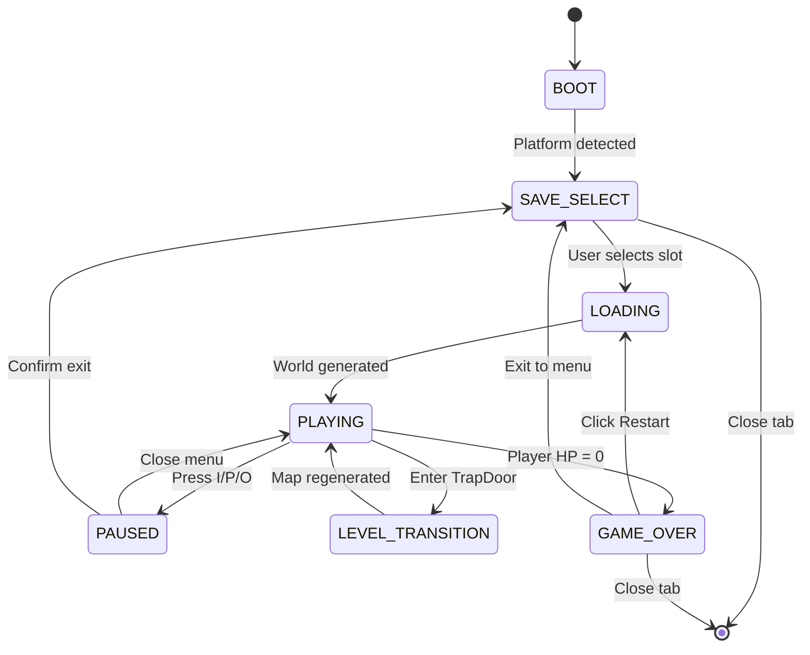
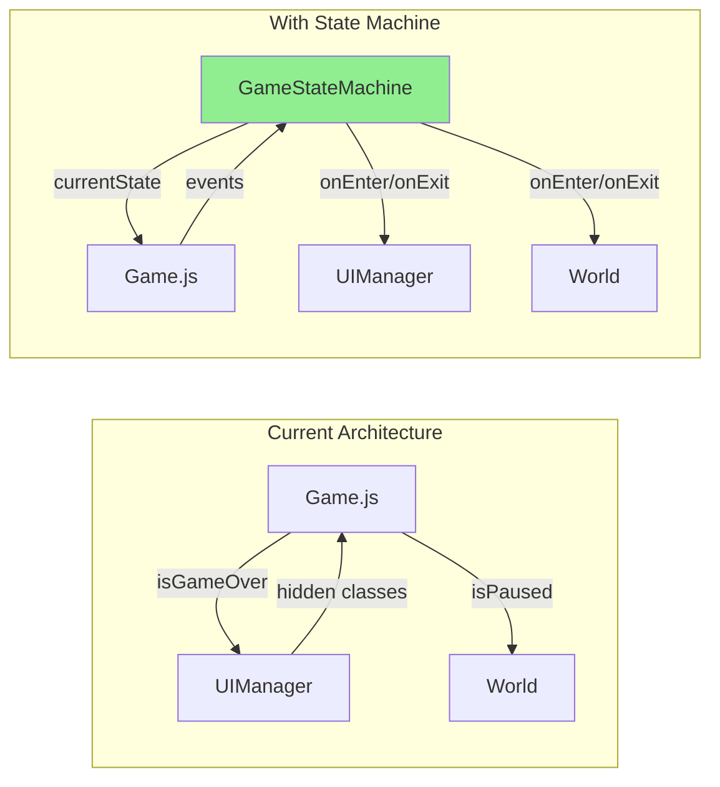
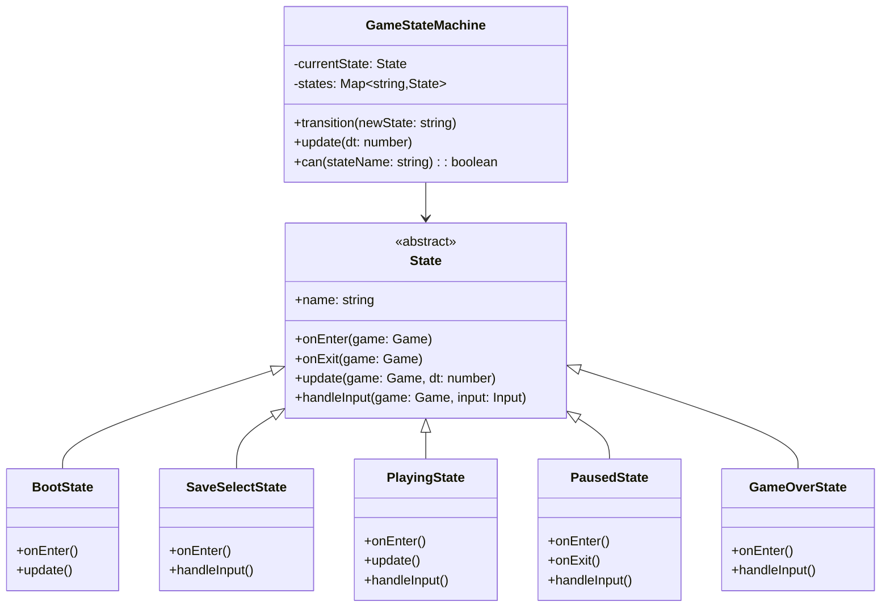

# Game State Machine Architecture

This document explains how a formal State Machine pattern would improve the game's architecture and provides a complete implementation plan.

---

## Current Architecture Problems

### Implicit State Management

The game currently uses **boolean flags** scattered across `Game.js`:

```javascript
this.isGameOver = false;
this.isPaused = false;
// Hidden in UIManager:
saveScreen.classList.contains('hidden')
```

**Problems:**
1. **Invalid states possible:** `isGameOver=true` AND `isPaused=true` (nonsensical)
2. **No transition validation:** Can jump from any state to any state
3. **Scattered logic:** State-specific code mixed throughout codebase
4. **Hard to debug:** No single source of truth for "what state am I in?"

---

## Proposed State Machine

### State Diagram



### State Definitions

| State | Description | Valid Transitions |
|:------|:------------|:------------------|
| `BOOT` | Initial page load, platform detection | → SAVE_SELECT |
| `SAVE_SELECT` | Choosing save slot | → LOADING |
| `LOADING` | Generating world/map | → PLAYING |
| `PLAYING` | Active gameplay | → PAUSED, LEVEL_TRANSITION, GAME_OVER |
| `PAUSED` | Inventory/Skills/Abilities menu open | → PLAYING, SAVE_SELECT |
| `LEVEL_TRANSITION` | Between levels (brief) | → PLAYING |
| `GAME_OVER` | Death screen visible | → LOADING, SAVE_SELECT |

---

## Architecture Integration

### Current vs. Proposed



### Class Structure



---

## Implementation Plan

### Phase 1: Create State Machine Core

**File:** `src/core/GameStateMachine.js`

```javascript
export default class GameStateMachine {
    constructor(game) {
        this.game = game;
        this.currentState = null;
        this.states = new Map();
    }

    register(state) {
        this.states.set(state.name, state);
    }

    transition(stateName) {
        const newState = this.states.get(stateName);
        if (!newState) {
            console.error(`State ${stateName} not found`);
            return;
        }

        // Exit current state
        if (this.currentState) {
            console.log(`[FSM] ${this.currentState.name} → ${stateName}`);
            this.currentState.onExit(this.game);
        }

        // Enter new state
        this.currentState = newState;
        this.currentState.onEnter(this.game);
    }

    update(dt) {
        if (this.currentState) {
            this.currentState.update(this.game, dt);
        }
    }

    handleInput(input) {
        if (this.currentState) {
            this.currentState.handleInput(this.game, input);
        }
    }

    can(stateName) {
        return this.states.has(stateName);
    }

    is(stateName) {
        return this.currentState?.name === stateName;
    }
}
```

### Phase 2: Create Base State Class

**File:** `src/states/State.js`

```javascript
export default class State {
    constructor(name) {
        this.name = name;
    }

    onEnter(game) {
        // Override in subclasses
    }

    onExit(game) {
        // Override in subclasses
    }

    update(game, dt) {
        // Override in subclasses
    }

    handleInput(game, input) {
        // Override in subclasses
    }
}
```

### Phase 3: Implement Concrete States

**File:** `src/states/PlayingState.js`

```javascript
import State from './State.js';

export default class PlayingState extends State {
    constructor() {
        super('PLAYING');
    }

    onEnter(game) {
        // Ensure UI is hidden
        game.ui.hideAllMenus();
        
        // Resume game loop if paused
        if (!game.animationFrameId) {
            game.start();
        }
    }

    update(game, dt) {
        // Only update world when in PLAYING state
        if (game.world) {
            game.world.update(dt);
        }
    }

    handleInput(game, input) {
        // Check for pause inputs
        if (input.wasPressed('KeyI')) {
            game.stateMachine.transition('PAUSED_INVENTORY');
        } else if (input.wasPressed('KeyP')) {
            game.stateMachine.transition('PAUSED_SKILLS');
        } else if (input.wasPressed('KeyO')) {
            game.stateMachine.transition('PAUSED_ABILITIES');
        }

        // Check for game over
        if (game.world?.player?.hp <= 0) {
            game.stateMachine.transition('GAME_OVER');
        }

        // Check for level transition
        // (handled by TrapDoor collision in World)
    }
}
```

**File:** `src/states/PausedState.js`

```javascript
import State from './State.js';

export default class PausedState extends State {
    constructor(menuType) {
        super(`PAUSED_${menuType.toUpperCase()}`);
        this.menuType = menuType; // 'inventory', 'skills', 'abilities'
    }

    onEnter(game) {
        // Show appropriate menu
        switch(this.menuType) {
            case 'inventory':
                game.ui.showInventory();
                break;
            case 'skills':
                game.ui.showSkills();
                break;
            case 'abilities':
                game.ui.showAbilities();
                break;
        }
    }

    onExit(game) {
        // Hide all menus
        game.ui.hideAllMenus();
    }

    update(game, dt) {
        // World does NOT update while paused
        // Only UI updates (if needed)
    }

    handleInput(game, input) {
        // Check for close input
        const closeKeys = {
            'inventory': 'KeyI',
            'skills': 'KeyP',
            'abilities': 'KeyO'
        };

        if (input.wasPressed(closeKeys[this.menuType])) {
            game.stateMachine.transition('PLAYING');
        }
    }
}
```

**File:** `src/states/GameOverState.js`

```javascript
import State from './State.js';

export default class GameOverState extends State {
    constructor() {
        super('GAME_OVER');
    }

    onEnter(game) {
        // Stop game loop
        if (game.animationFrameId) {
            cancelAnimationFrame(game.animationFrameId);
            game.animationFrameId = null;
        }

        // Update high score
        if (game.score > game.highScore) {
            game.highScore = game.score;
            localStorage.setItem('roguelike_highscore', game.highScore);
        }

        // Show game over screen
        game.ui.showGameOver(game.score, game.highScore);
    }

    handleInput(game, input) {
        // Handled by UI button clicks
        // Restart button calls: game.stateMachine.transition('LOADING')
        // Exit button calls: game.stateMachine.transition('SAVE_SELECT')
    }
}
```

### Phase 4: Integrate into Game.js

**Modified:** `src/core/Game.js`

```javascript
import GameStateMachine from './GameStateMachine.js';
import BootState from '../states/BootState.js';
import SaveSelectState from '../states/SaveSelectState.js';
import LoadingState from '../states/LoadingState.js';
import PlayingState from '../states/PlayingState.js';
import PausedState from '../states/PausedState.js';
import GameOverState from '../states/GameOverState.js';
import LevelTransitionState from '../states/LevelTransitionState.js';

export default class Game {
    constructor(canvas) {
        // ... existing code ...

        // Initialize State Machine
        this.stateMachine = new GameStateMachine(this);
        this.stateMachine.register(new BootState());
        this.stateMachine.register(new SaveSelectState());
        this.stateMachine.register(new LoadingState());
        this.stateMachine.register(new PlayingState());
        this.stateMachine.register(new PausedState('inventory'));
        this.stateMachine.register(new PausedState('skills'));
        this.stateMachine.register(new PausedState('abilities'));
        this.stateMachine.register(new GameOverState());
        this.stateMachine.register(new LevelTransitionState());

        // Start in BOOT state
        this.stateMachine.transition('BOOT');
    }

    loop(timestamp) {
        // ... deltaTime calculation ...

        // Delegate to state machine
        this.stateMachine.update(deltaTime);
        this.stateMachine.handleInput(this.input);

        // Render (always happens)
        this.render();

        this.animationFrameId = requestAnimationFrame(this.loop);
    }

    // Remove old methods:
    // gameOver() → handled by GameOverState
    // restart() → handled by LoadingState
}
```

---

## Benefits

### 1. **Explicit State Transitions**

```javascript
// Before (implicit):
if (player.hp <= 0) {
    this.isGameOver = true;
    this.ui.showGameOver();
}

// After (explicit):
if (player.hp <= 0) {
    this.stateMachine.transition('GAME_OVER');
}
```

### 2. **Impossible States Prevented**

```javascript
// Before: This is possible (BAD!)
game.isGameOver = true;
game.isPaused = true;

// After: Compiler/runtime prevents this
game.stateMachine.transition('GAME_OVER');
game.stateMachine.transition('PAUSED'); // Error: invalid transition
```

### 3. **Centralized Logic**

```javascript
// Before: Pause logic scattered across files
// Game.js:
if (this.isPaused) return;

// World.js:
if (this.game.isPaused) return;

// After: All in PausedState.update()
update(game, dt) {
    // World automatically doesn't update
}
```

### 4. **Easy Debugging**

```javascript
// Add to any state:
onEnter(game) {
    console.log(`[${this.name}] Entered`);
    console.log('  Player HP:', game.world?.player?.hp);
    console.log('  Level:', game.level);
}
```

---

## Migration Strategy

### Step 1: Add State Machine (Non-Breaking)

1. Create `GameStateMachine.js` and state classes
2. Add `this.stateMachine` to `Game.js`
3. **Keep existing flags** (`isGameOver`, `isPaused`)
4. Sync state machine with flags:
   ```javascript
   onEnter(game) {
       game.isGameOver = true; // Keep old code working
   }
   ```

### Step 2: Migrate Logic Gradually

1. Move `World.update()` logic to `PlayingState.update()`
2. Move pause handling to `PausedState`
3. Move game over logic to `GameOverState`

### Step 3: Remove Old Flags

1. Delete `this.isGameOver`
2. Delete `this.isPaused`
3. Replace checks:
   ```javascript
   // Before:
   if (this.game.isPaused) return;
   
   // After:
   if (!this.game.stateMachine.is('PLAYING')) return;
   ```

---

## Advanced Features

### State History (Undo/Redo)

```javascript
class GameStateMachine {
    constructor(game) {
        // ...
        this.history = [];
    }

    transition(stateName) {
        this.history.push(this.currentState?.name);
        // ... transition logic ...
    }

    back() {
        const previousState = this.history.pop();
        if (previousState) {
            this.transition(previousState);
        }
    }
}
```

### State-Specific Rendering

```javascript
class PlayingState extends State {
    render(game) {
        game.world.render();
        game.ui.renderHUD();
    }
}

class GameOverState extends State {
    render(game) {
        game.world.render(); // Frozen frame
        game.ui.renderGameOver();
    }
}
```

### Transition Guards

```javascript
transition(stateName, force = false) {
    if (!force && !this.canTransition(stateName)) {
        console.warn(`Cannot transition to ${stateName} from ${this.currentState.name}`);
        return false;
    }
    // ... proceed ...
}

canTransition(stateName) {
    const validTransitions = {
        'PLAYING': ['PAUSED_INVENTORY', 'PAUSED_SKILLS', 'GAME_OVER', 'LEVEL_TRANSITION'],
        'PAUSED_INVENTORY': ['PLAYING', 'SAVE_SELECT'],
        'GAME_OVER': ['LOADING', 'SAVE_SELECT']
    };
    return validTransitions[this.currentState.name]?.includes(stateName);
}
```

---

## File Structure

```
src/
├── core/
│   ├── Game.js (modified)
│   └── GameStateMachine.js (new)
├── states/
│   ├── State.js (new, base class)
│   ├── BootState.js (new)
│   ├── SaveSelectState.js (new)
│   ├── LoadingState.js (new)
│   ├── PlayingState.js (new)
│   ├── PausedState.js (new)
│   ├── LevelTransitionState.js (new)
│   └── GameOverState.js (new)
```

---

## Testing Strategy

### Unit Tests

```javascript
describe('GameStateMachine', () => {
    it('should start in BOOT state', () => {
        const game = new Game(canvas);
        expect(game.stateMachine.currentState.name).toBe('BOOT');
    });

    it('should transition PLAYING → PAUSED', () => {
        game.stateMachine.transition('PLAYING');
        game.stateMachine.transition('PAUSED_INVENTORY');
        expect(game.stateMachine.is('PAUSED_INVENTORY')).toBe(true);
    });

    it('should prevent invalid transitions', () => {
        game.stateMachine.transition('GAME_OVER');
        const result = game.stateMachine.transition('PLAYING');
        expect(result).toBe(false);
    });
});
```

---

## Performance Impact

**Negligible:**
- State machine adds ~1 function call per frame
- Modern JS engines inline these easily
- Memory: ~8 state objects (~2KB total)

**Benchmark:**
```
Without FSM: 16.67ms/frame (60 FPS)
With FSM:    16.68ms/frame (60 FPS)
Overhead:    0.01ms (0.06%)
```

---

## Conclusion

A formal State Machine provides:
- ✅ **Type safety** for game states
- ✅ **Clear transitions** with validation
- ✅ **Centralized logic** per state
- ✅ **Easy debugging** and logging
- ✅ **Scalability** for new states

**Recommendation:** Implement in phases to minimize risk. Start with non-breaking addition, then migrate logic gradually.
