# Gameplay Walkthrough: Sequential Flow

This document illustrates the sequential steps of a typical game session from launch to Game Over.

---

## Session Overview

**Duration:** ~7 minutes  
**Outcome:** Death on Level 2, 850 points  
**Key Events:** 10 enemy kills (Level 1), 8 enemy kills (Level 2)

---

## Phase 1: Initialization


**System State:**
- Game loop: NOT started
- World created: Yes (unused)
- UI visible: Save selection screen (3 slots)
- Touch controls: Hidden

---

## Phase 2: Save Selection & World Generation


**System State:**
- Game loop: RUNNING (60 FPS)
- World: #2 (playable)
- Entities: Player, TrapDoor, 4 Doors
- Enemies: 0 (lazy spawn)
- HUD: ❤️❤️❤️ | Level: 1 | Score: 0

---

## Phase 3: Room Entry & Enemy Spawn


**System State:**
- Entities: Player, TrapDoor, 4 Doors, **2 Walkers**
- Enemies visible: 2
- Room 1 status: spawned=true

**Enemy Stats (Walker):**
- HP: 3, Speed: 1.5, Damage: 1
- AI: Direct chase

---

## Phase 4: Combat Loop


**Combat Results:**
- Bullets fired: ~8
- Hits: 4 (2 per enemy)
- Coins dropped: 2
- Score: 0 → 20
- Bank: 0 → 10

---

## Phase 5: Door Progression


**Progression:**
- Rooms cleared: 1/5
- Doors opened: 1/4
- Current room: Room 2

---

## Phase 6: Damage & Healing

```mermaid
flowchart TD
    A([Enemy Contact]) --> B[Player.takeDamage 1]
    B --> C[HP: 3 → 2]
    C --> D[Set iframes = 60<br/>1 second invulnerable]
    D --> E[Player flashes white]
    E --> F[Kill enemy]
    F --> G{20% chance}
    G -->|Success| H[Spawn HealthPack]
    G -->|Fail| I[Spawn Coin only]
    H --> J[Player collects pack]
    I --> K([Continue])
    J --> L[HP: 2 → 3]
    L --> K
    
    style C fill:#ffcccc
    style L fill:#ccffcc
```



**Health State:**
- Before: ❤️❤️❤️
- After hit: ❤️❤️🖤
- After heal: ❤️❤️❤️

---

## Phase 7: Level Completion

```mermaid
flowchart TD
    A([Clear All 5 Rooms]) --> B[Navigate to exit room]
    B --> C[Touch TrapDoor]
    C --> D[World.nextLevel]
    D --> E[game.level++<br/>1 → 2]
    E --> F[game.score += 100<br/>350 → 450]
    F --> G[Clear all entities<br/>except Player]
    G --> H[Generate new Map]
    H --> I[Create 6 rooms<br/>more complex]
    I --> J[Respawn Player<br/>at new start]
    J --> K[Spawn new doors<br/>and TrapDoor]
    K --> L([Level 2 Active])
    
    style L fill:#ffffcc
```



**Level 2 Changes:**
- Rooms: 5 → 6
- Enemies per room: 2 → 3-4
- Enemy types: Walker, SmartEnemy, RapidFireEnemy, ShotgunEnemy
- Difficulty: Increased

---

## Phase 8: Death Sequence


**Final Stats:**
- Level reached: 2
- Score: 850
- High Score: 850 (new)
- Bank: 10 gold
- Total kills: 18 enemies

---

## Phase 9: Restart Flow


**Restart Behavior:**
- **Preserved:** Bank (10), unlocked skills, backpack items
- **Reset:** Level (→1), Score (→0), HP (→3)
- **New:** Fresh map, new enemy spawns

---

## Complete Session Timeline


---

## Key Metrics

### Timing
- Map generation: ~2 seconds
- Room combat: 30-60 seconds
- Level transition: Instant
- Death → Game Over: 0.5 seconds

### Progression Table

| Metric | Start | After L1 | After L2 | At Death |
|:-------|:------|:---------|:---------|:---------|
| Level | 1 | 2 | 2 | 2 |
| Score | 0 | 450 | 850 | 850 |
| Bank | 0 | 10 | 10 | 10 |
| HP | 3/3 | 3/3 | 1/3 | 0/3 |

### Enemy Scaling

**Level 1:** 2 per room, Walker only, 10 total kills  
**Level 2:** 3-4 per room, mixed types, 8 total kills (died early)

---

## System Behavior

### Deterministic
- Map generation algorithm (BSP)
- Enemy spawn counts (formula: `2 + level * 0.5`)
- Damage values (fixed per weapon/enemy)

### Random
- Room placement and connections
- Enemy type selection (weighted)
- Loot drops (20% health pack chance)
- Weapon stat ranges

### Performance
- Target: 60 FPS
- Spatial Hash: O(N) collision detection
- Lazy spawning: Enemies created on room entry only


**Player:** Sarah (new player)  
**Goal:** Reach Level 3 and unlock the "Speed Boost" skill  
**Duration:** ~15 minutes  
**Outcome:** Death on Level 2, 850 points earned

---

## Step 1: Page Load & Platform Detection


**What Sarah Sees:**
- Black screen with "SELECT RUN" title
- Three buttons: "EMPTY SLOT" (all three)
- No joysticks yet (game hasn't started)

---

## Step 2: Save Slot Selection


**What Sarah Sees:**
- Canvas shows dungeon with stone walls
- Player character (white square) at spawn point
- Two joysticks appear (bottom corners)
- Action buttons appear (right side)
- HUD shows: ❤️❤️❤️ | Level: 1 | Score: 0

**Map Generated:**
```
Room Layout (5 rooms):
┌─────┐     ┌─────┐
│  1  │─────│  2  │
└─────┘     └──┬──┘
               │
            ┌──┴──┐
            │  3  │
            └──┬──┘
         ┌─────┴─────┐
      ┌──┴──┐     ┌──┴──┐
      │  4  │     │  5  │ (Exit)
      └─────┘     └─────┘
```

---

## Step 3: First Room Entry & Enemy Spawn


**What Sarah Sees:**
- Two red enemies suddenly appear in the room
- They start moving toward her character
- No warning or fade-in (instant spawn)

**Enemy Stats (Level 1 Walker):**
- HP: 3
- Speed: 1.5
- Damage: 1
- Behavior: Chase player directly

---

## Step 4: Combat Sequence


**What Sarah Sees:**
- White projectiles shoot from player toward enemies
- Enemy flashes when hit
- Enemy disappears, gold coin drops
- Score: 0 → 10 (10 points per kill)

---

## Step 5: Loot Collection & Door Opening


**What Sarah Sees:**
- "Gold: 10" appears in HUD
- Door changes from closed (red) to open (green)
- She walks through freely
- New room revealed, 2 more enemies spawn

---

## Step 6: Taking Damage & Health Pack


**What Sarah Sees:**
- Enemy touches her → Heart in HUD turns grey (❤️❤️🖤)
- Player character flashes white briefly
- Kills enemy → Green health pack drops
- Picks up pack → Heart refills (❤️❤️❤️)

---

## Step 7: Level Completion (TrapDoor)

```mermaid
sequenceDiagram
    participant Sarah
    participant Player
    participant TrapDoor
    participant World
    participant Game
    
    Note over Sarah: Clears all 5 rooms<br/>Reaches final room
    
    Player->>TrapDoor: Collision detected
    TrapDoor->>World: nextLevel()
    activate World
    
    World->>Game: level++
    Note over Game: level = 1 → 2
    
    World->>Game: score += 100
    Note over Game: score = 350 → 450
    
    World->>World: Clear all entities (except Player)
    World->>World: new Map(game)
    Note over World: Generate fresh Level 2 map<br/>6 rooms this time
    
    World->>World: Respawn Player at new startPoint
    World->>World: Spawn new Doors & TrapDoor
    
    deactivate World
    
    World-->>Sarah: Screen fades<br/>New level appears
```



**What Sarah Sees:**
- Walks onto glowing purple trapdoor
- Brief fade to black
- New dungeon layout appears
- HUD updates: "Level: 2" | "Score: 450"
- Player HP and inventory preserved

**Level 2 Changes:**
- More rooms (6 instead of 5)
- More enemies per room (3-4 instead of 2)
- Tougher enemy types (RapidFireEnemy, ShotgunEnemy)

---

## Step 8: Death & Game Over

```mermaid
sequenceDiagram
    participant Sarah
    participant Player
    participant ShotgunEnemy
    participant Game
    participant UIManager
    
    Note over Sarah: Level 2, Room 3<br/>Surrounded by 3 enemies
    
    ShotgunEnemy->>Player: Fires shotgun blast (3 bullets)
    Player->>Player: Hit by 2 bullets<br/>hp = 3 - 2 = 1
    
    Note over Player: ❤️🖤🖤 (1 HP left)
    
    ShotgunEnemy->>Player: Fires again
    Player->>Player: Hit by 1 bullet<br/>hp = 1 - 1 = 0
    
    Player->>Player: die()
    Player->>Game: gameOver()
    activate Game
    
    Game->>Game: isGameOver = true
    Game->>Game: Check highScore
    Note over Game: 850 > 0<br/>New high score!
    
    Game->>Game: Save to localStorage
    Game->>UIManager: showGameOver(850, 850)
    
    deactivate Game
    
    UIManager-->>Sarah: Display Game Over screen
```



**What Sarah Sees:**
- Player character flashes red
- Screen shakes briefly
- Game Over screen appears:
  ```
  GAME OVER
  Score: 850
  High Score: 850
  
  [Restart Button]
  ```
- Touch controls remain visible but inactive

---

## Step 9: Restart Decision


**If Sarah Restarts:**
- Keeps: Bank (10 gold), any items in backpack
- Resets: Level → 1, Score → 0, HP → 3
- Gets: Fresh Level 1 map, new enemy spawns

**If Sarah Exits:**
- Progress saved to Slot 1:
  - Bank: 10 gold
  - High Score: 850
  - Unlocked Stats: (none yet)

---

## Complete Session Timeline


---

## Key Observations

### Timing Patterns

1. **Map Generation:** ~2 seconds (BSP algorithm + entity spawning)
2. **Room Combat:** 30-60 seconds per room (depends on enemy count)
3. **Level Transition:** Instant (no loading screen)
4. **Death → Game Over:** ~0.5 seconds

### Player Progression

| Metric | Start | After L1 | After L2 | At Death |
|:-------|:------|:---------|:---------|:---------|
| Level | 1 | 2 | 2 | 2 |
| Score | 0 | 450 | 850 | 850 |
| Bank | 0 | 10 | 10 | 10 |
| HP | 3/3 | 3/3 | 1/3 | 0/3 |

### Enemy Scaling

**Level 1:**
- 2 enemies per room
- Types: Walker only
- Total kills: 10 enemies

**Level 2:**
- 3-4 enemies per room
- Types: Walker, SmartEnemy, RapidFireEnemy, ShotgunEnemy
- Total kills: 8 enemies (died in Room 3)

---

## Common Player Paths

### Path A: "The Speedrunner"
1. Skip all optional rooms
2. Rush to TrapDoor
3. Reach Level 5+ in 10 minutes
4. Die to boss-level enemy swarms

### Path B: "The Completionist"
1. Clear every room
2. Collect all coins and items
3. Unlock skills between levels
4. Slower but stronger progression

### Path C: "The Unlucky"
1. Enter first room
2. Get cornered by Walkers
3. Die in 2 minutes
4. Restart immediately

---

## System Behavior Summary

### Deterministic Elements
- Map generation (same seed = same layout)
- Enemy spawn counts (formula-based)
- Damage values (fixed per weapon/enemy)

### Random Elements
- Room placement (BSP algorithm)
- Enemy types (weighted random)
- Loot drops (20% health pack chance)
- Weapon stats (random within range)

### Performance Checkpoints
- **60 FPS Target:** Maintained with <100 entities
- **Spatial Hash:** Reduces collision checks from O(N²) to O(N)
- **Lazy Spawning:** Enemies only created when room entered
